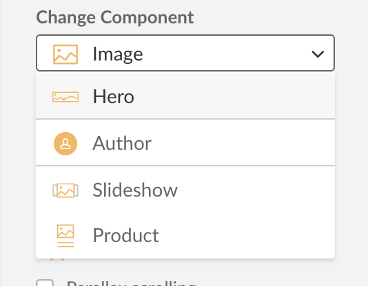

# Component Conversion Rules

Conversion rules define how one component type is converted into another component type.



## `auto` conversion

One option is to automatically map based on matching directive keys. Take the following two components `body` and `title` with these html templates:

`body` having the template:

```html
<p doc-editable="text"></p>
```

`title` having the template:

```html
<h1 doc-editable="text"></h1>
```

With these samples, `body` and `title` can be automatically mapped based on the matching `text` content keys by defining a mapping with the type `auto`:

```json
"body": {
    "title": "auto",
}
```

Any matching content keys of directives are copied to the new component. Non-matching directives are ignored and left empty.

## `simple` conversion

Another option is to use explicit mapping. This can be used when the directive keys do not match, but you still want to create a mapping. Let's look at the `body` and `title` components again, except now with the following html templates:

`body` having the template:

```html
<p doc-editable="text"></p>
```

`title` having the template:

```html
<h1 doc-editable="header-text"></h1>
```

```json
"body": {
    "title": {
        "type": "simple",
        "map": {
            "header-text": "text"
        }
    }
}
```

Here the field with key `text` is mapped to the field `header-text` of the `title` component.

## `from-container` conversion

This option can be used to turn a container type component into a regular component. It picks the first component of the container and discards the rest.

```json
"slideshow": {
    "image": {
        "type": "from-container",
        "container": "slideshow"
    }
}
```

## `to-container` conversion

This option can be used to automatically place a component into a container-like component.

```json
"image": {
    "slideshow": {
        "type": "to-container",
        "container": "slideshow"
    }
}
```
