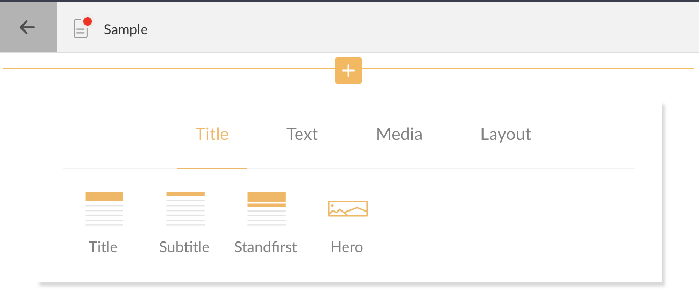

# Component Groups

Defines groups of components displayed in the component chooser. The component chooser allows inserting new components into the article.



An example of a completely custom group definition looks like:

```javascript
{
    // Name of group displayed in Component Chooser. See LOCALIZATION.md for information on
    // how to localize group names
    "label": "MyComponents",

    // Unique identifier of this group.
    "name": 'group-identifier',

    // List of Components, by id, to display in order they are defined.
    "components": [
        "my-component-1",
        "my-component-2"
    ]
}
```
